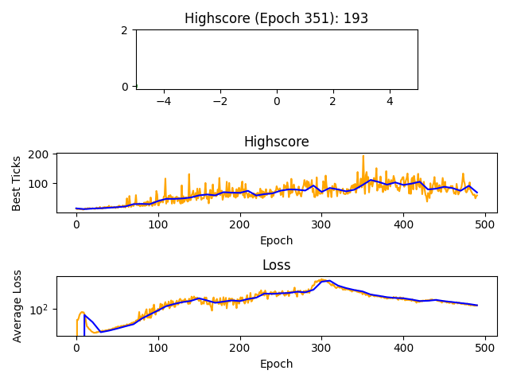

# Basic DeepQ Learning Implementation
Implementation of a cartpole environment and deep-q learning implementation.

## Interesting Emergent Behavior
Within the first 30 epochs, the network found that slamming into the 'wall' of the simulation space while tilting the pole toward the center could extend the time before losing balance.  This behavior continued until epoch ~200, when the network began moving back and forth to keep the pole upright.  Additionally, the agent began clearly favoring the middle of the simulation around epoch ~250.  The loss spike is likely the result of becoming stuck in an unfavorable strategy, likely that of ignoring movement toward the center.  The ability to recover from this spike speaks to the robustness of deep-q learning.  Although losses must be interpreted differently in deep-q learning when compared to traditional networks, these trends are clearly displayed on the loss graph.  The training proceeded as normal from there onward.  The high loss magnitude is owed to including velocity in the state vector, which frequently has magnitudes `>500`.  When trained for longer, without epsilon, the final model can likely remain upright indefinitely.
